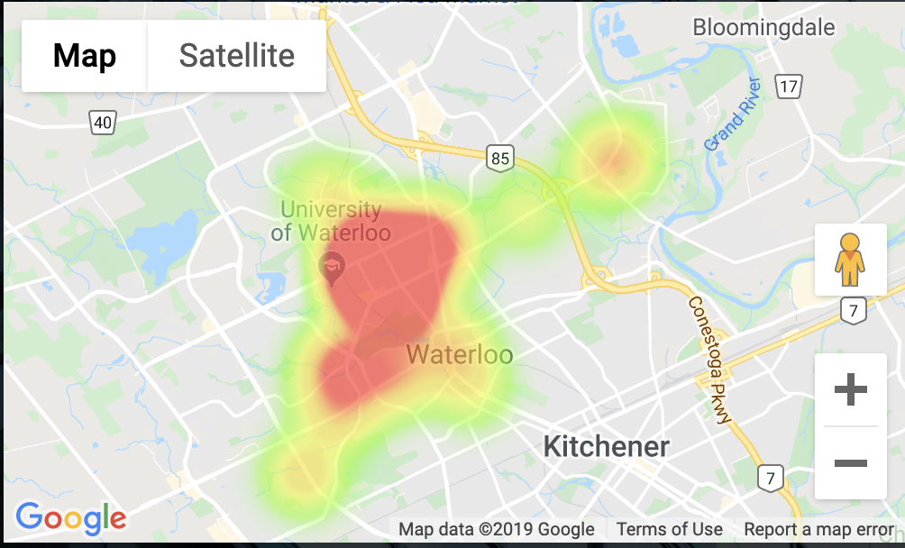
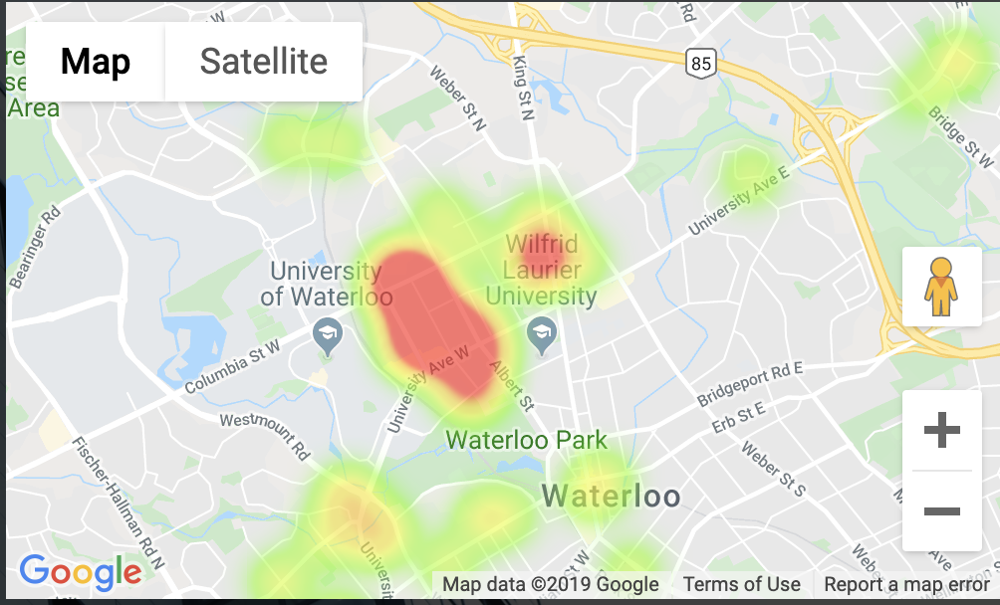

# [WatHaus.AI](https://wathaus-web.herokuapp.com/)

**Web application that determines the best student housing option for University of Waterloo students based on a person's preferences**

**Data was collected via Google Forms from over 300 students**

#### Satisfaction by Region



#### Price by Region



### Prerequisites

* Ruby on Rails v 5.x
* Node.js v8.x

### Instructions for future developers

1. Clone the repo ```git clone https://github.com/djoksimo/WatHaus.AI.git ```
2. Run ```bundle install``` in api directory to install the Ruby gems
3. Run ```npm install``` in web directory to install the React app dependencies
4. Run ```npm start``` in web dircectory to locally run React app on port 3006
5. Create database by running ```rails db:create``` or send us a note for database migration
6. Migrate database models by running ```rails db:migrate```
5. Run ```rails server``` in api directory to locally launch web server
6. Get REST api routes by running ```rails routes``` in api directory

### TODOs:

- [ ] Deployment on Google Kubernetes Engine 
- [ ] Web scrapers to collect student housing satisfaction data
- [ ] Scale to include other Canadian universities and colleges
- [ ] Improve UI/UX
- [ ] Account for proximity bias (more students live closer to campus)
- [ ] Dockerize code
- [ ] Sentiment analysis in Ruby to judge bad experiences reported by students
- [ ] Get images based on apartment addresses using Google APIs
- [ ] Add form for collecting apartment satisfaction data to improve model accuracy
- [ ] Automate malarkey removal from Google Form data

**[Contact me](https://keybase.io/jokdanilo) for Heroku, CI/CD, and Security information**
